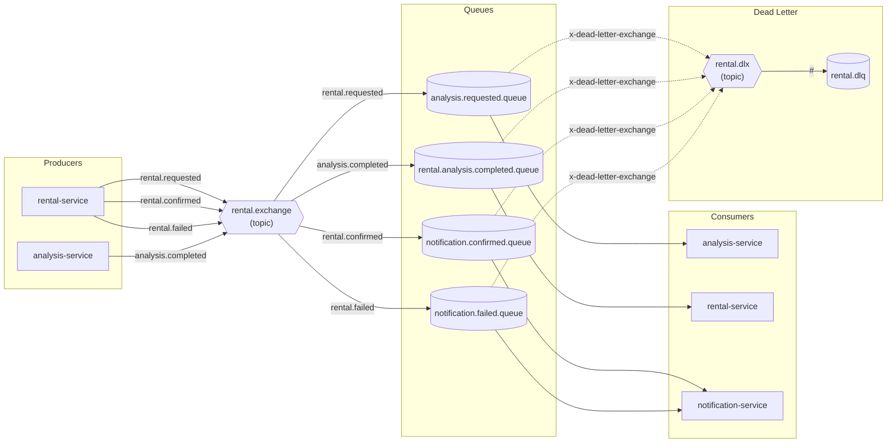

# Mensageria RabbitRide

Este documento descreve a topologia AMQP do RabbitRide, as garantias
de entrega e os padrões de resiliência adotados (retry, DLQ,
idempotência).

## Visão geral

O RabbitRide usa **um único exchange topic** (`rental.exchange`) que
recebe todos os eventos da saga de aluguel. Cada serviço consome
apenas as queues que lhe interessam, filtradas por routing key.

Falhas no consumer são tratadas com **retry com backoff exponencial**
no analysis-service e **dead-lettering automático** quando os retries
se esgotam — a mensagem cai numa DLQ central (`rental.dlq`) para
inspeção manual.

## Topologia



## Exchanges

| Nome | Tipo | Durável | Descrição |
|---|---|---|---|
| `rental.exchange` | topic | sim | Exchange principal. Recebe todos os eventos da saga. |
| `rental.dlx` | topic | sim | Dead Letter Exchange. Recebe mensagens rejeitadas após esgotar retries. |

## Queues

| Nome | Consumer | Routing key | DLX configurado |
|---|---|---|---|
| `analysis.requested.queue` | analysis-service | `rental.requested` | `rental.dlx` |
| `rental.analysis.completed.queue` | rental-service | `analysis.completed` | `rental.dlx` |
| `notification.confirmed.queue` | notification-service | `rental.confirmed` | `rental.dlx` |
| `notification.failed.queue` | notification-service | `rental.failed` | `rental.dlx` |
| `rental.dlq` | (manual / ferramenta de operação) | `#` | (nenhum — é o destino final) |

Todas as queues são **duráveis** (sobrevivem a restart do broker) e
têm o argumento `x-dead-letter-exchange` apontando para `rental.dlx`,
exceto a própria DLQ.

## Routing keys

| Routing key | Emissor | Significado |
|---|---|---|
| `rental.requested` | rental-service | Nova solicitação de aluguel registrada (status PENDENTE). |
| `analysis.completed` | analysis-service | Análise de crédito concluída — APPROVED ou REJECTED com motivo. |
| `rental.confirmed` | rental-service | Aluguel confirmado e carro reservado com sucesso. |
| `rental.failed` | rental-service | Aluguel não pôde ser concretizado (reprovação ou indisponibilidade). |

## Fluxo end-to-end

1. `POST /rentals` → rental-service salva como PENDENTE e publica
   `rental.requested`.
2. analysis-service consome, consulta blacklist por CPF e publica
   `analysis.completed` (APPROVED ou REJECTED).
3. rental-service consome:
    - REJECTED → marca como REJEITADO e publica `rental.failed`.
    - APPROVED → chama car-service via Feign para reservar o carro;
      se OK, marca como CONFIRMADO e publica `rental.confirmed`;
      se carro indisponível, publica `rental.failed`.
4. notification-service consome `rental.confirmed` ou `rental.failed`
   e dispara o e-mail apropriado via MailHog.

## Retry e backoff exponencial

O analysis-service tem **retry stateless com backoff exponencial**
configurado via Spring Retry. Em caso de falha do consumer, a
mensagem é reprocessada na própria thread antes de ser rejeitada.

Parâmetros (em `application.yml`, sob `app.retry`):

| Parâmetro | Valor | Significado |
|---|---|---|
| `max-attempts` | 3 | Total de tentativas (1 inicial + 2 retries) |
| `initial-interval-ms` | 1000 | Intervalo inicial entre tentativas |
| `multiplier` | 2.0 | Fator de crescimento exponencial |
| `max-interval-ms` | 10000 | Teto absoluto entre tentativas |

Curva real com esses valores:

```
Tentativa 1 → falha → espera 1.0s
Tentativa 2 → falha → espera 2.0s
Tentativa 3 → falha → rejeita (vai pro DLX)
```

Total até dead-lettering: ~3 segundos.

## Dead Letter Queue (DLQ)

Quando uma mensagem é rejeitada pelo consumer e a queue de origem
tem `x-dead-letter-exchange` configurado, o RabbitMQ roteia
automaticamente a mensagem para o DLX (`rental.dlx`) com a routing
key original.

O DLX está bound à queue `rental.dlq` com routing key wildcard `#`
— captura **qualquer** mensagem rejeitada de **qualquer** queue.
Esse modelo centraliza falhas em um único lugar para investigação.

Mensagens no DLQ não são reprocessadas automaticamente. A ação
manual de ops é:

1. Inspecionar a mensagem no console RabbitMQ (`localhost:15672`).
2. Identificar a causa raiz (bug, dado inválido, dependência fora).
3. Após resolver: re-publicar a mensagem (via console ou shovel).

## Idempotência

Consumers que publicam efeitos colaterais (especialmente
`AnalysisCompletedEvent` no analysis-service e
`processarResultadoAnalise` no rental-service) implementam o padrão
**Idempotent Consumer**:

- Tabela `processed_event` com `event_id` (UUID, PK), `consumer`,
  `processed_at`.
- Antes de processar: `existsById(eventId)` — se já existe, ignora.
- No final do processamento: `save(new ProcessedEvent(eventId, ...))`.
- Tudo dentro de `@Transactional`.

Isso garante que entregas duplicadas (intrínsecas ao at-least-once
do AMQP) não causem efeitos duplicados.

### Limitação conhecida

A operação de publicar no RabbitMQ não é parte da transação JPA
(dual-write). Em caso de crash entre `convertAndSend` e o `save`
em `processed_event`, a mensagem pode ser publicada duas vezes —
mitigado pela idempotência downstream. Solução completa seria
adotar o padrão **Transactional Outbox**, deferido como melhoria
futura.

## Inspeção local

### Console RabbitMQ

URL: `http://localhost:15672`
Credenciais (defaults do `docker-compose.yml`): `rabbitride` /
`rabbitride`.

Abas mais usadas:
- **Queues**: ver contagem de mensagens, mensagens unacked, taxa
  de publicação/consumo.
- **Exchanges**: publicar mensagens manualmente (útil para smoke
  tests).
- **Connections / Channels**: verificar se cada serviço está
  conectado.

### Comandos úteis

```bash
# Listar queues e contagens de mensagens
docker exec rabbitride-rabbitmq rabbitmqctl list_queues

# Limpar uma queue
docker exec rabbitride-rabbitmq rabbitmqctl purge_queue rental.dlq

# Deletar uma queue (cuidado)
docker exec rabbitride-rabbitmq rabbitmqctl delete_queue notification.queue
```
